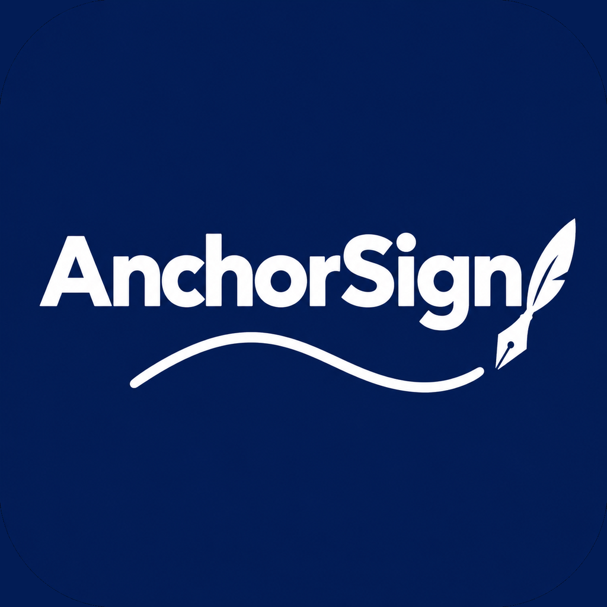

<div align="center">
  

  # AnchorSign 

An advanced code signing tool, forked from [Feather](https://github.com/claration/Feather).

  [](#)
  [](https://github.com/mirazbakis/xsign/releases](https://github.com/mirazbakis/xsign/releases/download/1.0.0/XSign.ipa
)
  [](LICENSE)

  <br>

</div>

<h3 align="center">
<a href="https://altdirect.app/?url=https://raw.githubusercontent.com/mirazbakis/xsign/main/source.json"></a>
&nbsp;
<a href="https://github.com/mirazbakis/xsign/releases/download/1.0.0/XSign.ipa"></a>
</h3>

---

### Source URL
```
https://raw.githubusercontent.com/mirazbakis/xsign/main/source.json
```

